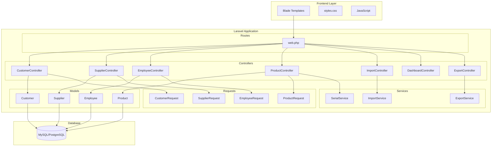

# Design Document - Tháng 1: Nền tảng (Laravel)

## Overview

Giai đoạn Tháng 1 tập trung xây dựng nền tảng Master Data cho hệ thống Mini ERP/CRM sử dụng Laravel framework. Các module chính bao gồm: Quản lý Khách hàng, Nhà cung cấp, Nhân viên, Sản phẩm, Import dữ liệu, Dashboard tổng quan và Xuất Excel.

## Architecture



## Components and Interfaces

### 1. Controllers

#### CustomerController

```php
class CustomerController extends Controller
{
    public function index(Request $request)      // GET /customers - List with search/filter
    public function create()                      // GET /customers/create - Show form
    public function store(CustomerRequest $req)   // POST /customers - Create
    public function show(Customer $customer)      // GET /customers/{id} - View detail
    public function edit(Customer $customer)      // GET /customers/{id}/edit - Edit form
    public function update(CustomerRequest $req, Customer $customer) // PUT /customers/{id}
    public function destroy(Customer $customer)   // DELETE /customers/{id}
    public function export(Request $request)      // GET /customers/export - Export Excel
}
```

#### SupplierController

```php
class SupplierController extends Controller
{
    public function index(Request $request)
    public function create()
    public function store(SupplierRequest $request)
    public function show(Supplier $supplier)
    public function edit(Supplier $supplier)
    public function update(SupplierRequest $request, Supplier $supplier)
    public function destroy(Supplier $supplier)
    public function export(Request $request)
}
```

#### EmployeeController

```php
class EmployeeController extends Controller
{
    public function index(Request $request)
    public function create()
    public function store(EmployeeRequest $request)
    public function show(Employee $employee)
    public function edit(Employee $employee)
    public function update(EmployeeRequest $request, Employee $employee)
    public function destroy(Employee $employee)
    public function export(Request $request)
}
```

#### ProductController

```php
class ProductController extends Controller
{
    public function index(Request $request)
    public function create()
    public function store(ProductRequest $request)
    public function show(Product $product)
    public function edit(Product $product)
    public function update(ProductRequest $request, Product $product)
    public function destroy(Product $product)
    public function export(Request $request)
    public function generateSerial(Product $product) // POST /products/{id}/generate-serial
}
```

#### ImportController

```php
class ImportController extends Controller
{
    public function index()                       // GET /import - Show import page
    public function template(string $type)        // GET /import/template/{type} - Download template
    public function preview(Request $request)     // POST /import/preview - Preview import data
    public function store(Request $request)       // POST /import - Execute import
}
```

#### DashboardController

```php
class DashboardController extends Controller
{
    public function index()                       // GET /dashboard - Show dashboard
}
```

### 2. Form Requests (Validation)

#### CustomerRequest

```php
class CustomerRequest extends FormRequest
{
    public function rules(): array
    {
        return [
            'code' => ['required', 'string', 'max:50', Rule::unique('customers')->ignore($this->customer)],
            'name' => ['required', 'string', 'max:255'],
            'email' => ['required', 'email', 'max:255'],
            'phone' => ['required', 'string', 'max:20'],
            'address' => ['nullable', 'string', 'max:500'],
            'type' => ['required', 'in:normal,vip'],
            'tax_code' => ['nullable', 'string', 'max:50'],
            'website' => ['nullable', 'url', 'max:255'],
            'contact_person' => ['nullable', 'string', 'max:255'],
            'debt_limit' => ['nullable', 'numeric', 'min:0'],
            'debt_days' => ['nullable', 'integer', 'min:0'],
            'note' => ['nullable', 'string'],
        ];
    }
}
```

#### SupplierRequest

```php
class SupplierRequest extends FormRequest
{
    public function rules(): array
    {
        return [
            'code' => ['required', 'string', 'max:50', Rule::unique('suppliers')->ignore($this->supplier)],
            'name' => ['required', 'string', 'max:255'],
            'email' => ['required', 'email', 'max:255'],
            'phone' => ['required', 'string', 'max:20'],
            'address' => ['nullable', 'string', 'max:500'],
            'tax_code' => ['nullable', 'string', 'max:50'],
            'website' => ['nullable', 'url', 'max:255'],
            'contact_person' => ['nullable', 'string', 'max:255'],
            'payment_terms' => ['nullable', 'integer', 'min:0'],
            'product_type' => ['nullable', 'string', 'max:255'],
            'note' => ['nullable', 'string'],
        ];
    }
}
```

#### EmployeeRequest

```php
class EmployeeRequest extends FormRequest
{
    public function rules(): array
    {
        return [
            'code' => ['required', 'string', 'max:50', Rule::unique('employees')->ignore($this->employee)],
            'name' => ['required', 'string', 'max:255'],
            'birth_date' => ['nullable', 'date'],
            'email' => ['required', 'email', 'max:255'],
            'phone' => ['required', 'string', 'max:20'],
            'address' => ['nullable', 'string', 'max:500'],
            'department' => ['required', 'string', 'max:100'],
            'position' => ['required', 'string', 'max:100'],
            'join_date' => ['nullable', 'date'],
            'salary' => ['nullable', 'numeric', 'min:0'],
            'id_card' => ['nullable', 'string', 'max:50'],
            'bank_account' => ['nullable', 'string', 'max:50'],
            'bank_name' => ['nullable', 'string', 'max:100'],
            'status' => ['required', 'in:active,leave,resigned'],
            'note' => ['nullable', 'string'],
        ];
    }
}
```

#### ProductRequest

```php
class ProductRequest extends FormRequest
{
    public function rules(): array
    {
        return [
            'code' => ['required', 'string', 'max:50', Rule::unique('products')->ignore($this->product)],
            'name' => ['required', 'string', 'max:255'],
            'category' => ['nullable', 'string', 'max:100'],
            'unit' => ['required', 'string', 'max:50'],
            'price' => ['required', 'numeric', 'min:0'],
            'cost' => ['required', 'numeric', 'min:0'],
            'stock' => ['nullable', 'integer', 'min:0'],
            'min_stock' => ['nullable', 'integer', 'min:0'],
            'max_stock' => ['nullable', 'integer', 'min:0'],
            'management_type' => ['required', 'in:normal,serial,lot'],
            'auto_generate_serial' => ['nullable', 'boolean'],
            'serial_prefix' => ['nullable', 'string', 'max:20'],
            'expiry_months' => ['nullable', 'integer', 'min:0'],
            'track_expiry' => ['nullable', 'boolean'],
            'description' => ['nullable', 'string'],
            'note' => ['nullable', 'string'],
        ];
    }
}
```

### 3. Services

#### ImportService

```php
class ImportService
{
    public function parseExcel(UploadedFile $file): Collection
    public function validateData(Collection $data, string $type): array // Returns [valid, invalid, duplicates]
    public function importCustomers(Collection $data): array // Returns [success, failed, skipped]
    public function importProducts(Collection $data): array
    public function generateTemplate(string $type): string // Returns file path
}
```

#### ExportService

```php
class ExportService
{
    public function exportCustomers(Collection $customers): string
    public function exportSuppliers(Collection $suppliers): string
    public function exportEmployees(Collection $employees): string
    public function exportProducts(Collection $products): string
}
```

#### SerialService

```php
class SerialService
{
    public function generate(Product $product): string
    public function generateLotNumber(): string
    public function generateInternalSerial(string $productCode): string
}
```

## Data Models (Database Schema)

### customers table

```php
Schema::create('customers', function (Blueprint $table) {
    $table->id();
    $table->string('code', 50)->unique();
    $table->string('name', 255);
    $table->string('email', 255);
    $table->string('phone', 20);
    $table->text('address')->nullable();
    $table->enum('type', ['normal', 'vip'])->default('normal');
    $table->string('tax_code', 50)->nullable();
    $table->string('website', 255)->nullable();
    $table->string('contact_person', 255)->nullable();
    $table->decimal('debt_limit', 15, 2)->default(0);
    $table->integer('debt_days')->default(0);
    $table->text('note')->nullable();
    $table->timestamps();
    
    $table->index('code');
    $table->index('type');
    $table->index('name');
});
```

### suppliers table

```php
Schema::create('suppliers', function (Blueprint $table) {
    $table->id();
    $table->string('code', 50)->unique();
    $table->string('name', 255);
    $table->string('email', 255);
    $table->string('phone', 20);
    $table->text('address')->nullable();
    $table->string('tax_code', 50)->nullable();
    $table->string('website', 255)->nullable();
    $table->string('contact_person', 255)->nullable();
    $table->integer('payment_terms')->default(30);
    $table->string('product_type', 255)->nullable();
    $table->text('note')->nullable();
    $table->timestamps();
    
    $table->index('code');
    $table->index('name');
});
```

### employees table

```php
Schema::create('employees', function (Blueprint $table) {
    $table->id();
    $table->string('code', 50)->unique();
    $table->string('name', 255);
    $table->date('birth_date')->nullable();
    $table->string('email', 255);
    $table->string('phone', 20);
    $table->text('address')->nullable();
    $table->string('department', 100);
    $table->string('position', 100);
    $table->date('join_date')->nullable();
    $table->decimal('salary', 15, 2)->default(0);
    $table->string('id_card', 50)->nullable();
    $table->string('bank_account', 50)->nullable();
    $table->string('bank_name', 100)->nullable();
    $table->enum('status', ['active', 'leave', 'resigned'])->default('active');
    $table->text('note')->nullable();
    $table->timestamps();
    
    $table->index('code');
    $table->index('department');
    $table->index('status');
    $table->index('name');
});
```

### products table

```php
Schema::create('products', function (Blueprint $table) {
    $table->id();
    $table->string('code', 50)->unique();
    $table->string('name', 255);
    $table->string('category', 100)->nullable();
    $table->string('unit', 50);
    $table->decimal('price', 15, 2);
    $table->decimal('cost', 15, 2);
    $table->integer('stock')->default(0);
    $table->integer('min_stock')->default(0);
    $table->integer('max_stock')->default(0);
    $table->enum('management_type', ['normal', 'serial', 'lot'])->default('normal');
    $table->boolean('auto_generate_serial')->default(false);
    $table->string('serial_prefix', 20)->nullable();
    $table->integer('expiry_months')->nullable();
    $table->boolean('track_expiry')->default(false);
    $table->text('description')->nullable();
    $table->text('note')->nullable();
    $table->timestamps();
    
    $table->index('code');
    $table->index('category');
    $table->index('management_type');
    $table->index('name');
});
```

## Correctness Properties

*A property is a characteristic or behavior that should hold true across all valid executions of a system-essentially, a formal statement about what the system should do. Properties serve as the bridge between human-readable specifications and machine-verifiable correctness guarantees.*

### Property 1: CRUD Round-Trip Consistency for Customers

*For any* valid customer data, creating a customer and then retrieving it by ID should return an equivalent record with all fields preserved.

**Validates: Requirements 1.3, 1.5, 1.6**

### Property 2: CRUD Round-Trip Consistency for Suppliers

*For any* valid supplier data, creating a supplier and then retrieving it by ID should return an equivalent record with all fields preserved.

**Validates: Requirements 2.3, 2.5, 2.6**

### Property 3: CRUD Round-Trip Consistency for Employees

*For any* valid employee data, creating an employee and then retrieving it by ID should return an equivalent record with all fields preserved.

**Validates: Requirements 3.3, 3.5, 3.6**

### Property 4: CRUD Round-Trip Consistency for Products

*For any* valid product data, creating a product and then retrieving it by ID should return an equivalent record with all fields preserved.

**Validates: Requirements 4.5, 4.7, 4.8**

### Property 5: Create Increases Count

*For any* entity type (customer, supplier, employee, product) and valid data, creating a new record should increase the total count by exactly 1.

**Validates: Requirements 1.3, 2.3, 3.3, 4.5**

### Property 6: Delete Decreases Count

*For any* entity type and existing record ID, deleting the record should decrease the total count by exactly 1 and the record should no longer be retrievable.

**Validates: Requirements 1.8, 2.8, 3.8, 4.10**

### Property 7: Validation Rejects Invalid Data

*For any* entity data with missing required fields, the FormRequest validation should fail and return appropriate error messages.

**Validates: Requirements 1.4, 2.4, 3.4, 4.6**

### Property 8: Unique Code Constraint

*For any* entity type, attempting to create a record with a code that already exists should fail validation.

**Validates: Requirements 1.3, 2.3, 3.3, 4.5, 5.6**

### Property 9: Search Returns Matching Results

*For any* search term and entity list, all returned results should contain the search term in at least one of the searchable fields.

**Validates: Requirements 1.9, 2.9, 3.9, 4.11**

### Property 10: Filter Returns Correct Subset

*For any* filter criteria and entity list, all returned results should match the filter criteria exactly.

**Validates: Requirements 1.10, 3.10, 4.12**

### Property 11: Serial Number Uniqueness

*For any* number of generated serial numbers with the same prefix, all generated serials should be unique.

**Validates: Requirements 4.13**

### Property 12: Import Validation Consistency

*For any* import data array, the sum of (valid + invalid + duplicate) counts should equal the total input count.

**Validates: Requirements 5.5, 5.6, 5.7, 5.8**

### Property 13: Dashboard Count Consistency

*For any* state of the system, the dashboard summary counts should equal the actual counts of records in database for each entity type.

**Validates: Requirements 6.1, 6.6**

### Property 14: Export Data Completeness

*For any* entity list and column configuration, the exported data should contain exactly the same number of rows as the input list (excluding header).

**Validates: Requirements 7.1, 7.6**

## Error Handling

### Validation Errors (422 Unprocessable Entity)

Laravel FormRequest tự động xử lý và trả về JSON errors:

```json
{
    "message": "The given data was invalid.",
    "errors": {
        "code": ["Mã đã tồn tại trong hệ thống."],
        "email": ["Email không đúng định dạng."]
    }
}
```

### Not Found Errors (404)

```php
// Model binding tự động throw ModelNotFoundException
// Customize trong Handler.php
```

### Server Errors (500)

```php
// Log error và trả về thông báo chung
// Không expose chi tiết lỗi cho user
```

## Testing Strategy

### Unit Testing

Sử dụng PHPUnit (built-in Laravel).

**Test Coverage:**
- Model validation rules
- Service methods (ImportService, ExportService, SerialService)
- Controller actions
- Form Request validation

### Property-Based Testing

Sử dụng **PhpQuickCheck** hoặc **Eris** library cho property-based testing.

**Configuration:**
- Minimum 100 iterations per property test
- Custom generators for entity data models

**Test Annotations:**
```php
// **Feature: month1-foundation, Property 1: CRUD Round-Trip Consistency for Customers**
```

### Feature Testing

- Test full HTTP request/response cycle
- Test form submissions
- Test search and filter functionality
- Test import/export flows

## File Structure

```
app/
├── Http/
│   ├── Controllers/
│   │   ├── CustomerController.php
│   │   ├── SupplierController.php
│   │   ├── EmployeeController.php
│   │   ├── ProductController.php
│   │   ├── ImportController.php
│   │   ├── DashboardController.php
│   │   └── ExportController.php
│   └── Requests/
│       ├── CustomerRequest.php
│       ├── SupplierRequest.php
│       ├── EmployeeRequest.php
│       └── ProductRequest.php
├── Models/
│   ├── Customer.php
│   ├── Supplier.php
│   ├── Employee.php
│   └── Product.php
└── Services/
    ├── ImportService.php
    ├── ExportService.php
    └── SerialService.php

database/
├── migrations/
│   ├── create_customers_table.php
│   ├── create_suppliers_table.php
│   ├── create_employees_table.php
│   └── create_products_table.php
└── seeders/
    └── DatabaseSeeder.php

resources/
└── views/
    ├── layouts/
    │   └── app.blade.php
    ├── customers/
    │   ├── index.blade.php
    │   ├── create.blade.php
    │   ├── edit.blade.php
    │   └── show.blade.php
    ├── suppliers/
    ├── employees/
    ├── products/
    ├── import/
    │   └── index.blade.php
    └── dashboard/
        └── index.blade.php

tests/
├── Unit/
│   ├── Services/
│   │   ├── ImportServiceTest.php
│   │   ├── ExportServiceTest.php
│   │   └── SerialServiceTest.php
│   └── Models/
├── Feature/
│   ├── CustomerTest.php
│   ├── SupplierTest.php
│   ├── EmployeeTest.php
│   ├── ProductTest.php
│   ├── ImportTest.php
│   └── DashboardTest.php
└── Property/
    ├── CrudPropertyTest.php
    ├── ValidationPropertyTest.php
    ├── SearchFilterPropertyTest.php
    └── SerialPropertyTest.php
```

## Dependencies

### Laravel Packages

| Package | Purpose |
|---------|---------|
| maatwebsite/excel | Excel import/export |
| laravel/ui hoặc livewire | Frontend scaffolding |

### Frontend

| Library | Version | Purpose |
|---------|---------|---------|
| Font Awesome | 6.4.0 | Icons |
| Chart.js | 4.4.0 | Dashboard charts |
| Bootstrap 5 | 5.3.x | CSS framework (optional) |

### Development Dependencies

| Package | Purpose |
|---------|---------|
| phpunit/phpunit | Testing |
| giorgiosironi/eris | Property-based testing |
