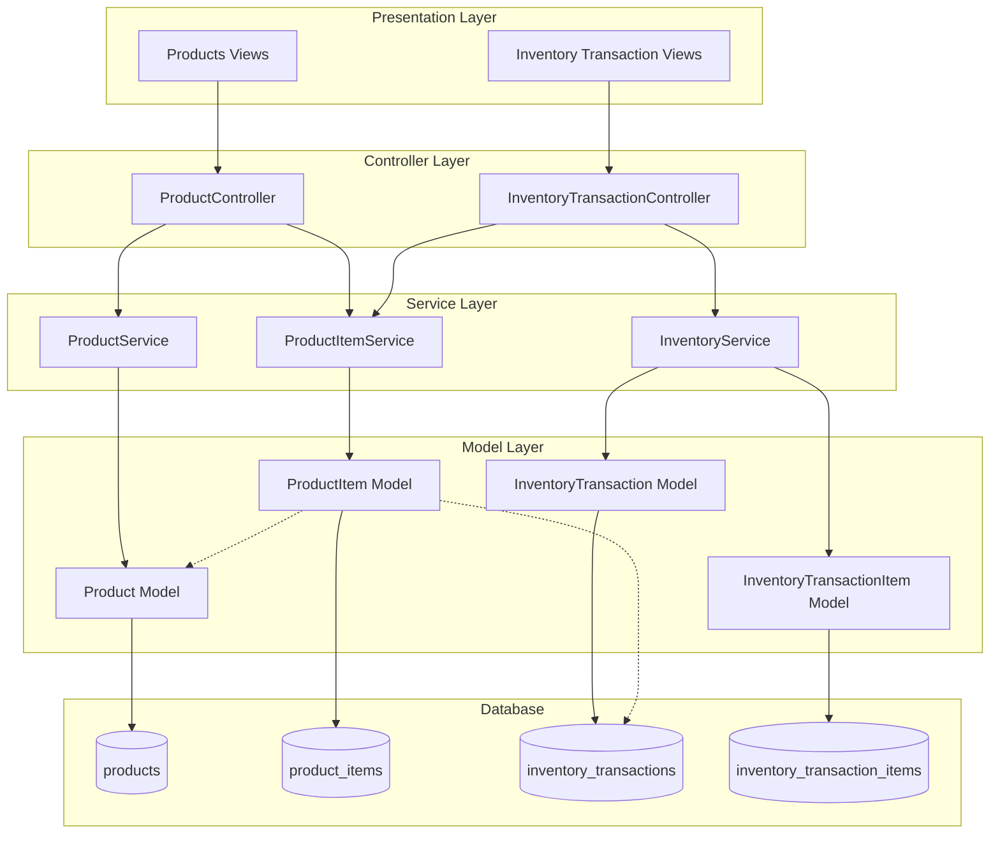

# Design Document: Product Module Restructure V2

## Overview

Thiết kế này mô tả việc tái cấu trúc module Sản phẩm trong hệ thống ERP-CRM. Mục tiêu chính là:
- Đơn giản hóa bảng `products` chỉ chứa thông tin cơ bản
- Tạo bảng `product_items` mới để quản lý từng đơn vị sản phẩm với SKU và giá theo năm
- Cập nhật quy trình nhập kho để tạo product_items với nhiều SKU
- Loại bỏ các trường không cần thiết (stock, min_stock, max_stock, price, cost...)

## Architecture



## Components and Interfaces

### 1. Product Model (Updated)

```php
// App\Models\Product
class Product extends Model
{
    protected $fillable = [
        'code',
        'name', 
        'category',
        'unit',
        'description',
        'note',
    ];
    
    // Relationships
    public function items(): HasMany;
    public function getTotalQuantityAttribute(): int;
    public function getInStockQuantityAttribute(): int;
    
    // Scopes
    public function scopeSearch(Builder $query, ?string $search): Builder;
    public function scopeFilterByCategory(Builder $query, ?string $category): Builder;
}
```

### 2. ProductItem Model (New)

```php
// App\Models\ProductItem
class ProductItem extends Model
{
    protected $fillable = [
        'product_id',
        'sku',
        'description',
        'price',
        'price_1yr',
        'price_2yr', 
        'price_3yr',
        'price_4yr',
        'price_5yr',
        'quantity',
        'comments',
        'warehouse_id',
        'inventory_transaction_id',
        'status', // 'in_stock', 'sold', 'damaged', 'transferred'
    ];
    
    // Relationships
    public function product(): BelongsTo;
    public function warehouse(): BelongsTo;
    public function inventoryTransaction(): BelongsTo;
    
    // Methods
    public static function generateNoSku(int $productId): string;
    public function isNoSku(): bool;
}
```

### 3. ProductController (Updated)

```php
// App\Http\Controllers\ProductController
class ProductController extends Controller
{
    public function index(Request $request);  // List products with basic info
    public function create();                  // Form with basic fields only
    public function store(Request $request);   // Save basic product info
    public function show($id);                 // Show product + related items
    public function edit($id);                 // Edit basic info
    public function update(Request $request, $id);
    public function destroy($id);
    public function items($id);                // API: Get product items
}
```

### 4. ProductItemService (New)

```php
// App\Services\ProductItemService
class ProductItemService
{
    public function createItemsFromImport(
        int $productId,
        int $quantity,
        array $skus,
        array $priceData,
        int $warehouseId,
        int $transactionId
    ): Collection;
    
    public function generateNoSku(int $productId): string;
    public function validateSkuUniqueness(int $productId, array $skus): bool;
    public function updateItemStatus(int $itemId, string $status): bool;
}
```

### 5. InventoryTransactionController (Updated)

```php
// Updated import method signature
public function storeImport(Request $request)
{
    // Validate request with multiple SKUs
    // Create inventory transaction
    // Create product_items via ProductItemService
    // Update inventory quantities
}
```

## Data Models

### Products Table (Updated Schema)

```sql
-- Migration: update_products_table_simplify
ALTER TABLE products
    DROP COLUMN price,
    DROP COLUMN cost,
    DROP COLUMN stock,
    DROP COLUMN min_stock,
    DROP COLUMN max_stock,
    DROP COLUMN management_type,
    DROP COLUMN auto_generate_serial,
    DROP COLUMN serial_prefix,
    DROP COLUMN expiry_months,
    DROP COLUMN track_expiry;

-- Final structure:
CREATE TABLE products (
    id BIGINT UNSIGNED PRIMARY KEY AUTO_INCREMENT,
    code VARCHAR(50) UNIQUE NOT NULL,
    name VARCHAR(255) NOT NULL,
    category CHAR(1) NULL,           -- Single letter: A, B, C, D, E, F, J, S...
    unit VARCHAR(50) NOT NULL,
    description TEXT NULL,
    note TEXT NULL,
    created_at TIMESTAMP NULL,
    updated_at TIMESTAMP NULL,
    
    INDEX idx_code (code),
    INDEX idx_category (category),
    INDEX idx_name (name)
);
```

### Product Items Table (New)

```sql
CREATE TABLE product_items (
    id BIGINT UNSIGNED PRIMARY KEY AUTO_INCREMENT,
    product_id BIGINT UNSIGNED NOT NULL,
    sku VARCHAR(100) NOT NULL,
    description TEXT NULL,
    price DECIMAL(15,2) DEFAULT 0,
    price_1yr DECIMAL(15,2) NULL,
    price_2yr DECIMAL(15,2) NULL,
    price_3yr DECIMAL(15,2) NULL,
    price_4yr DECIMAL(15,2) NULL,
    price_5yr DECIMAL(15,2) NULL,
    quantity INT DEFAULT 1,
    comments TEXT NULL,
    warehouse_id BIGINT UNSIGNED NULL,
    inventory_transaction_id BIGINT UNSIGNED NULL,
    status ENUM('in_stock', 'sold', 'damaged', 'transferred') DEFAULT 'in_stock',
    created_at TIMESTAMP NULL,
    updated_at TIMESTAMP NULL,
    
    FOREIGN KEY (product_id) REFERENCES products(id) ON DELETE CASCADE,
    FOREIGN KEY (warehouse_id) REFERENCES warehouses(id) ON DELETE SET NULL,
    FOREIGN KEY (inventory_transaction_id) REFERENCES inventory_transactions(id) ON DELETE SET NULL,
    
    UNIQUE INDEX idx_product_sku (product_id, sku),
    INDEX idx_status (status),
    INDEX idx_warehouse (warehouse_id)
);
```

### Category Values

```php
// Available categories (single letters)
const CATEGORIES = ['A', 'B', 'C', 'D', 'E', 'F', 'G', 'H', 'I', 'J', 'K', 'L', 'M', 'N', 'O', 'P', 'Q', 'R', 'S', 'T', 'U', 'V', 'W', 'X', 'Y', 'Z'];
```

### NO_SKU Format

```php
// Format: NOSKU-{product_id}-{sequential_number}
// Example: NOSKU-15-001, NOSKU-15-002, NOSKU-15-003
// Sequential number is padded to 3 digits, resets per product
```


## Correctness Properties

*A property is a characteristic or behavior that should hold true across all valid executions of a system-essentially, a formal statement about what the system should do. Properties serve as the bridge between human-readable specifications and machine-verifiable correctness guarantees.*

### Property 1: Product Display Contains Only Basic Fields
*For any* product retrieved from the system, the response SHALL contain only the fields: id, code, name, category, unit, description, note, created_at, updated_at and SHALL NOT contain: price, cost, stock, min_stock, max_stock, management_type, serial_prefix, expiry_months, track_expiry, location.
**Validates: Requirements 1.1, 1.2, 6.2**

### Property 2: Category Validation
*For any* category input, the Product_Module SHALL accept the value if and only if it is a single uppercase letter (A-Z) or null.
**Validates: Requirements 2.1, 2.2**

### Property 3: Category Filter Correctness
*For any* category filter applied to product list, all returned products SHALL have a category matching the filter value.
**Validates: Requirements 2.3**

### Property 4: Product Item Requires Valid Product Reference
*For any* product item creation attempt, the operation SHALL succeed if and only if the product_id references an existing product.
**Validates: Requirements 3.2**

### Property 5: SKU Uniqueness Within Product
*For any* product, all product_items belonging to that product SHALL have unique SKU values. Creating a product_item with a duplicate SKU for the same product SHALL fail.
**Validates: Requirements 3.3, 4.5**

### Property 6: NO_SKU Format Correctness
*For any* generated NO_SKU identifier, it SHALL match the pattern `NOSKU-{product_id}-{sequential_number}` where sequential_number is a 3-digit zero-padded number.
**Validates: Requirements 3.4**

### Property 7: Import Creates Correct Number of Items
*For any* import transaction with quantity Q and S provided SKUs (where S ≤ Q), the system SHALL create exactly S items with provided SKUs and (Q - S) items with generated NO_SKU identifiers.
**Validates: Requirements 4.2, 4.3**

### Property 8: Price Tier Nullable
*For any* product item, all price tier fields (price_1yr through price_5yr) SHALL accept null or zero values without validation errors.
**Validates: Requirements 5.3**

### Property 9: Product Detail Includes Items
*For any* product with associated product_items, the product detail response SHALL include a list of all related product_items with their SKUs and all price tier values.
**Validates: Requirements 3.5, 6.4**

### Property 10: Import Links Items to Transaction
*For any* product_item created through an import transaction, the item's inventory_transaction_id SHALL reference the creating transaction.
**Validates: Requirements 7.1**

### Property 11: Export Updates Item Status
*For any* inventory export transaction, all affected product_items SHALL have their status changed from 'in_stock' to 'sold' or 'transferred'.
**Validates: Requirements 7.3**

### Property 12: Stock Calculation from In-Stock Items
*For any* product, the calculated stock quantity SHALL equal the sum of quantities from all product_items where status is 'in_stock'.
**Validates: Requirements 7.4**

## Error Handling

### Validation Errors

| Error Code | Condition | Response |
|------------|-----------|----------|
| INVALID_CATEGORY | Category is not a single uppercase letter | 422 - "Category must be a single letter (A-Z)" |
| DUPLICATE_SKU | SKU already exists for this product | 422 - "SKU already exists for this product" |
| INVALID_PRODUCT_REF | product_id does not exist | 422 - "Product not found" |
| QUANTITY_MISMATCH | Provided SKUs exceed quantity | 422 - "Number of SKUs cannot exceed quantity" |
| INVALID_PRICE | Price is negative | 422 - "Price must be non-negative" |

### Business Logic Errors

| Error Code | Condition | Response |
|------------|-----------|----------|
| ITEM_NOT_IN_STOCK | Attempting to export item not in stock | 400 - "Item is not available in stock" |
| INSUFFICIENT_QUANTITY | Export quantity exceeds available | 400 - "Insufficient quantity in stock" |

## Testing Strategy

### Property-Based Testing Framework
- **Framework**: PHPUnit with custom generators
- **Minimum iterations**: 100 per property test

### Unit Tests
- Product CRUD operations with basic fields only
- ProductItem creation and validation
- Category validation (single letter)
- SKU uniqueness validation
- NO_SKU generation format

### Property-Based Tests
Each correctness property will be implemented as a property-based test:

1. **Property 1 Test**: Generate random products, verify response structure
2. **Property 2 Test**: Generate random strings, verify category validation
3. **Property 3 Test**: Generate products with various categories, verify filter results
4. **Property 4 Test**: Generate product_items with valid/invalid product_ids
5. **Property 5 Test**: Generate multiple SKUs for same product, verify uniqueness
6. **Property 6 Test**: Generate NO_SKUs, verify format pattern
7. **Property 7 Test**: Generate imports with varying quantity/SKU ratios
8. **Property 8 Test**: Generate product_items with null/zero prices
9. **Property 9 Test**: Generate products with items, verify detail response
10. **Property 10 Test**: Generate imports, verify transaction linkage
11. **Property 11 Test**: Generate exports, verify status changes
12. **Property 12 Test**: Generate products with mixed status items, verify stock calculation

### Integration Tests
- Full import workflow with multiple SKUs
- Export workflow with status updates
- Product listing with category filter
- Product detail with items list
