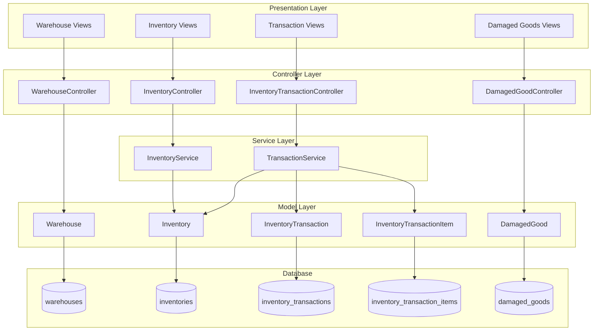

# Design Document - Module Kho (Warehouse Module)

## Overview

Module Kho được thiết kế để quản lý toàn bộ hoạt động kho bãi trong hệ thống ERP-CRM. Module bao gồm 4 thành phần chính: Warehouses, Inventory, Inventory Transactions, và Damaged Goods. Thiết kế tuân theo kiến trúc MVC của Laravel với các best practices về validation, relationships, và data integrity.

## Architecture



## Components and Interfaces

### 1. Models

#### Warehouse Model
```php
class Warehouse extends Model
{
    protected $fillable = [
        'code', 'name', 'type', 'address', 'area', 'capacity',
        'manager_id', 'phone', 'status', 'product_type',
        'has_temperature_control', 'has_security_system', 'note'
    ];
    
    // Relationships
    public function manager(): BelongsTo
    public function inventories(): HasMany
    public function transactions(): HasMany
    
    // Scopes
    public function scopeActive($query)
    public function scopeByType($query, $type)
}
```

#### Inventory Model
```php
class Inventory extends Model
{
    protected $fillable = [
        'product_id', 'warehouse_id', 'stock', 'min_stock',
        'avg_cost', 'expiry_date', 'warranty_months'
    ];
    
    // Relationships
    public function product(): BelongsTo
    public function warehouse(): BelongsTo
    
    // Scopes
    public function scopeLowStock($query)
    public function scopeExpiringSoon($query, $days = 30)
}
```

#### InventoryTransaction Model
```php
class InventoryTransaction extends Model
{
    protected $fillable = [
        'code', 'type', 'warehouse_id', 'to_warehouse_id',
        'date', 'employee_id', 'total_qty', 'reference_type',
        'reference_id', 'note', 'status'
    ];
    
    // Relationships
    public function warehouse(): BelongsTo
    public function toWarehouse(): BelongsTo
    public function employee(): BelongsTo
    public function items(): HasMany
    
    // Scopes
    public function scopeByType($query, $type)
    public function scopeByDateRange($query, $from, $to)
}
```

#### InventoryTransactionItem Model
```php
class InventoryTransactionItem extends Model
{
    protected $fillable = [
        'transaction_id', 'product_id', 'quantity', 'unit', 'serial_number'
    ];
    
    // Relationships
    public function transaction(): BelongsTo
    public function product(): BelongsTo
}
```

#### DamagedGood Model
```php
class DamagedGood extends Model
{
    protected $fillable = [
        'code', 'type', 'product_id', 'quantity', 'original_value',
        'recovery_value', 'reason', 'status', 'discovery_date',
        'discovered_by', 'solution', 'note'
    ];
    
    // Relationships
    public function product(): BelongsTo
    public function discoveredBy(): BelongsTo
    
    // Scopes
    public function scopeByType($query, $type)
    public function scopeByStatus($query, $status)
}
```

### 2. Controllers

#### WarehouseController
- `index()` - List warehouses with filters
- `create()` - Show create form
- `store()` - Save new warehouse
- `show($id)` - View warehouse details
- `edit($id)` - Show edit form
- `update($id)` - Update warehouse
- `destroy($id)` - Delete warehouse (with inventory check)

#### InventoryController
- `index()` - List inventory with filters
- `show($id)` - View inventory details
- `lowStock()` - List low stock items
- `expiringSoon()` - List expiring items

#### InventoryTransactionController
- `index()` - List transactions with filters
- `create()` - Show create form
- `store()` - Process transaction (import/export/transfer)
- `show($id)` - View transaction details

#### DamagedGoodController
- `index()` - List damaged goods
- `create()` - Show create form
- `store()` - Save damaged goods record
- `show($id)` - View details
- `edit($id)` - Show edit form
- `update($id)` - Update record
- `updateStatus($id)` - Change status

### 3. Services

#### InventoryService
```php
class InventoryService
{
    public function updateStock(int $productId, int $warehouseId, int $quantity, string $operation): Inventory
    public function calculateAverageCost(int $productId, int $warehouseId): float
    public function checkLowStock(int $productId, int $warehouseId): bool
    public function getExpiringItems(int $days = 30): Collection
}
```

#### TransactionService
```php
class TransactionService
{
    public function processImport(array $data): InventoryTransaction
    public function processExport(array $data): InventoryTransaction
    public function processTransfer(array $data): InventoryTransaction
    public function generateTransactionCode(string $type): string
    public function validateStock(int $productId, int $warehouseId, int $quantity): bool
}
```

### 4. Form Requests

#### WarehouseRequest
- Validate: code (unique), name (required), type (in:physical,virtual), status (in:active,maintenance,inactive)

#### InventoryTransactionRequest
- Validate: type (required, in:import,export,transfer), warehouse_id (required, exists), items (required, array)

#### DamagedGoodRequest
- Validate: type (required, in:damaged,liquidation), product_id (required, exists), quantity (required, min:1)

## Data Models

### Database Schema

```mermaid
erDiagram
    warehouses {
        bigint id PK
        string code UK
        string name
        enum type
        text address
        decimal area
        integer capacity
        bigint manager_id FK
        string phone
        enum status
        string product_type
        boolean has_temperature_control
        boolean has_security_system
        text note
        timestamps
    }
    
    inventories {
        bigint id PK
        bigint product_id FK
        bigint warehouse_id FK
        integer stock
        integer min_stock
        decimal avg_cost
        date expiry_date
        integer warranty_months
        timestamps
    }
    
    inventory_transactions {
        bigint id PK
        string code UK
        enum type
        bigint warehouse_id FK
        bigint to_warehouse_id FK
        date date
        bigint employee_id FK
        integer total_qty
        string reference_type
        bigint reference_id
        text note
        enum status
        timestamps
    }
    
    inventory_transaction_items {
        bigint id PK
        bigint transaction_id FK
        bigint product_id FK
        integer quantity
        string unit
        string serial_number
        timestamps
    }
    
    damaged_goods {
        bigint id PK
        string code UK
        enum type
        bigint product_id FK
        integer quantity
        decimal original_value
        decimal recovery_value
        text reason
        enum status
        date discovery_date
        bigint discovered_by FK
        text solution
        text note
        timestamps
    }
    
    warehouses ||--o{ inventories : has
    warehouses ||--o{ inventory_transactions : has
    products ||--o{ inventories : has
    products ||--o{ inventory_transaction_items : has
    products ||--o{ damaged_goods : has
    inventory_transactions ||--o{ inventory_transaction_items : has
    users ||--o{ warehouses : manages
    users ||--o{ inventory_transactions : creates
    users ||--o{ damaged_goods : discovers
```

### Enum Values

**Warehouse Type:**
- `physical` - Kho vật lý
- `virtual` - Kho ảo

**Warehouse Status:**
- `active` - Đang hoạt động
- `maintenance` - Đang bảo trì
- `inactive` - Ngừng hoạt động

**Transaction Type:**
- `import` - Nhập kho
- `export` - Xuất kho
- `transfer` - Chuyển kho

**Transaction Status:**
- `pending` - Chờ xử lý
- `completed` - Hoàn thành
- `cancelled` - Đã hủy

**Damaged Good Type:**
- `damaged` - Hàng hư hỏng
- `liquidation` - Hàng thanh lý

**Damaged Good Status:**
- `pending` - Chờ xử lý
- `processing` - Đang xử lý
- `resolved` - Đã xử lý
- `written_off` - Đã xóa sổ


## Correctness Properties

*A property is a characteristic or behavior that should hold true across all valid executions of a system-essentially, a formal statement about what the system should do. Properties serve as the bridge between human-readable specifications and machine-verifiable correctness guarantees.*

Based on the prework analysis, the following correctness properties have been identified:

### Property 1: Warehouse Code Uniqueness
*For any* warehouse creation request with valid data, the system SHALL generate a unique warehouse code that does not exist in the database.
**Validates: Requirements 1.1**

### Property 2: Warehouse Deletion Integrity
*For any* warehouse that has associated inventory records, attempting to delete that warehouse SHALL fail and return an error.
**Validates: Requirements 1.4, 1.5**

### Property 3: Low Stock Detection
*For any* inventory record where stock < min_stock, the lowStock scope SHALL include that record in its results.
**Validates: Requirements 2.2**

### Property 4: Expiry Warning Detection
*For any* inventory record where expiry_date is within 30 days from current date, the expiringSoon scope SHALL include that record.
**Validates: Requirements 2.5**

### Property 5: Import Transaction Stock Increase
*For any* import transaction with quantity Q for product P in warehouse W, after the transaction completes, the inventory stock for (P, W) SHALL equal previous_stock + Q.
**Validates: Requirements 3.1, 2.4**

### Property 6: Export Transaction Stock Decrease
*For any* export transaction with quantity Q for product P in warehouse W where current_stock >= Q, after the transaction completes, the inventory stock for (P, W) SHALL equal previous_stock - Q.
**Validates: Requirements 3.2, 2.4**

### Property 7: Export Validation
*For any* export transaction with quantity Q for product P in warehouse W where current_stock < Q, the transaction SHALL be rejected with insufficient stock error.
**Validates: Requirements 3.2**

### Property 8: Transfer Stock Conservation
*For any* transfer transaction moving quantity Q of product P from warehouse W1 to warehouse W2, the total stock (W1.stock + W2.stock) SHALL remain constant before and after the transfer.
**Validates: Requirements 3.3**

### Property 9: Transaction Data Round-Trip
*For any* valid transaction data object, serializing to export format then parsing back SHALL produce an equivalent transaction object.
**Validates: Requirements 3.7, 3.8**

### Property 10: Damaged Goods Code Uniqueness
*For any* damaged goods creation request, the system SHALL generate a unique code that does not exist in the database.
**Validates: Requirements 4.1**

### Property 11: Report Aggregation Accuracy
*For any* set of inventory records, the inventory summary report totals SHALL equal the sum of individual record values.
**Validates: Requirements 5.1, 5.2**

### Property 12: Filter Results Correctness
*For any* filter criteria applied to warehouse/inventory/transaction lists, all returned records SHALL match the specified filter criteria.
**Validates: Requirements 1.2, 2.3, 3.5, 4.4**

## Error Handling

### Validation Errors
- Return 422 Unprocessable Entity with field-specific error messages
- Use Laravel Form Request validation for consistent error format

### Business Logic Errors
- Insufficient stock: Return 400 Bad Request with clear message
- Warehouse has inventory: Return 409 Conflict when attempting deletion
- Invalid transaction type: Return 400 Bad Request

### Database Errors
- Use database transactions for multi-table operations
- Rollback on any failure during transaction processing
- Log errors for debugging

### Error Response Format
```json
{
    "success": false,
    "message": "Error description",
    "errors": {
        "field_name": ["Specific error message"]
    }
}
```

## Testing Strategy

### Testing Framework
- PHPUnit for unit and feature tests
- Laravel's built-in testing utilities
- Faker for test data generation

### Unit Tests
- Model relationship tests
- Scope method tests
- Service method tests
- Validation rule tests

### Feature Tests
- CRUD operations for each entity
- Transaction processing (import/export/transfer)
- Filter and search functionality
- Error handling scenarios

### Property-Based Tests
Using PHPUnit with custom data providers to simulate property-based testing:

1. **Stock Conservation Property Test**
   - Generate random transactions
   - Verify stock levels are correctly updated
   - Test with various quantities and products

2. **Filter Correctness Property Test**
   - Generate random filter criteria
   - Verify all returned records match criteria

3. **Transaction Round-Trip Property Test**
   - Generate random transaction data
   - Serialize and deserialize
   - Verify data integrity

### Test Data Strategy
- Use factories for generating test data
- Create seeders for development/testing environments
- Isolate tests using database transactions

### Test Coverage Goals
- Models: 100% coverage for relationships and scopes
- Services: 100% coverage for business logic
- Controllers: 90% coverage for CRUD operations
- Integration: Key user flows covered
