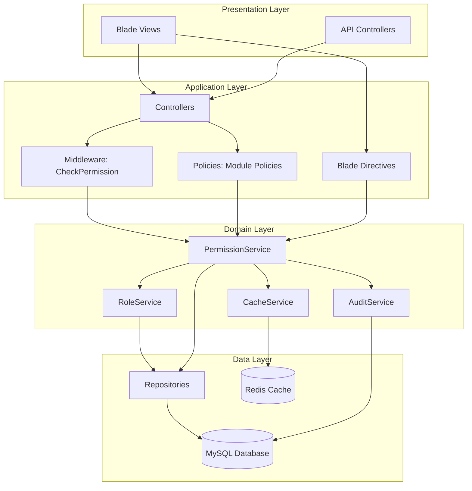
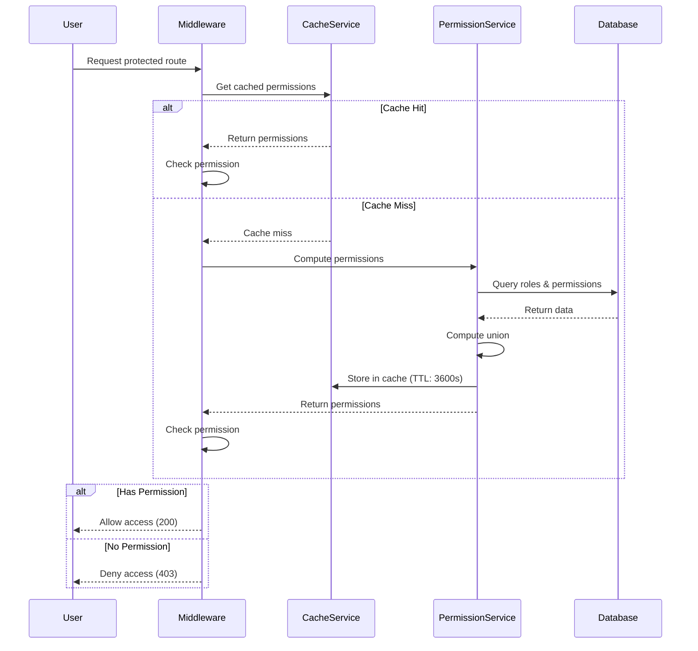
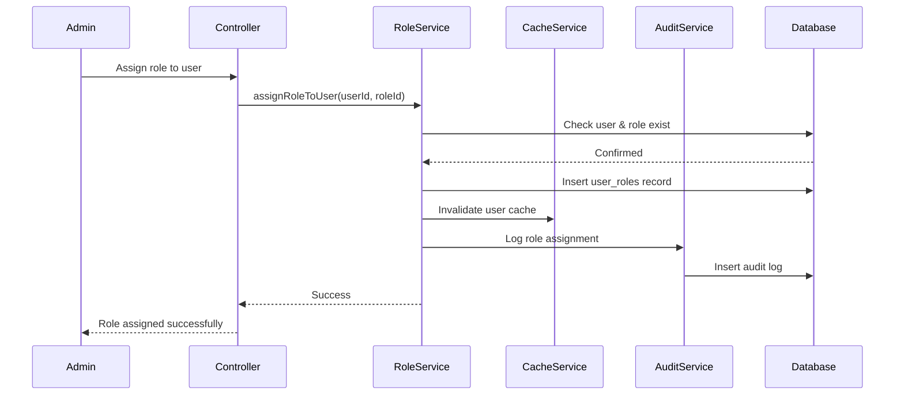
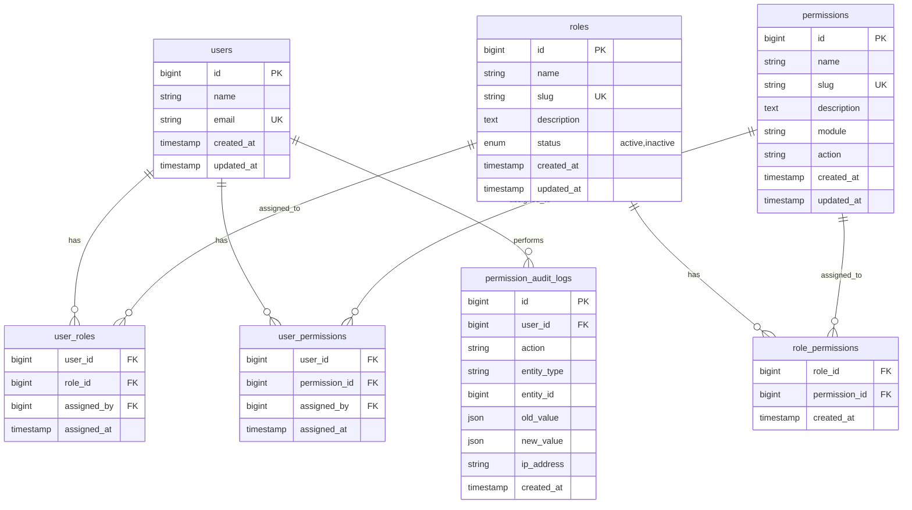

# Design Document: Role-Based Access Control

## Overview

Hệ thống Role-Based Access Control (RBAC) cung cấp cơ chế phân quyền truy cập toàn diện cho Mini ERP Laravel. Hệ thống cho phép quản trị viên định nghĩa vai trò (roles), gán quyền (permissions) cho vai trò, và gán vai trò cho nhân viên. Ngoài ra, hệ thống hỗ trợ gán quyền trực tiếp cho nhân viên để xử lý các trường hợp đặc biệt.

### Key Features

- Quản lý vai trò và quyền với giao diện CRUD đầy đủ
- Permission matrix cho phép gán quyền hàng loạt
- Hỗ trợ cả quyền dựa trên vai trò và quyền trực tiếp
- Middleware và Policy tích hợp Laravel để kiểm soát truy cập
- Cache quyền với Redis để tối ưu hiệu suất
- Audit logging đầy đủ cho mọi thay đổi phân quyền
- Data filtering dựa trên quyền (view_own vs view_all)
- Blade directives để kiểm soát UI elements
- API đơn giản cho developers

### Design Goals

1. **Security**: Đảm bảo không có privilege escalation, fail-safe khi cache không khả dụng
2. **Performance**: Permission check < 50ms với cache, cache invalidation < 5s
3. **Maintainability**: Separation of concerns với Middleware, Policy, Service layers
4. **Auditability**: Ghi log đầy đủ mọi thay đổi về vai trò và quyền
5. **Flexibility**: Hỗ trợ cả role-based và direct permissions
6. **Developer Experience**: API rõ ràng, dễ sử dụng

## Architecture

### High-Level Architecture



### Component Interaction Flow

#### Permission Check Flow



#### Role Assignment Flow



### Layer Responsibilities

#### Presentation Layer
- **Blade Views**: Hiển thị UI cho quản lý roles, permissions, assignments
- **API Controllers**: Expose REST endpoints cho external integrations

#### Application Layer
- **Middleware (CheckPermission)**: Intercept requests, verify permissions trước khi route đến controller
- **Policies**: Encapsulate authorization logic cho từng module (CustomerPolicy, WarehousePolicy, etc.)
- **Controllers**: Handle HTTP requests, delegate business logic đến services
- **Blade Directives**: @can, @canany, @role, @hasrole cho conditional rendering

#### Domain Layer
- **RoleService**: Business logic cho role management (CRUD, validation)
- **PermissionService**: Compute effective permissions, check permissions
- **CacheService**: Manage permission cache lifecycle (get, set, invalidate)
- **AuditService**: Record all permission-related changes

#### Data Layer
- **Repositories**: Abstract database access (RoleRepository, PermissionRepository)
- **Redis Cache**: Store computed permissions với TTL 3600s
- **MySQL Database**: Persistent storage cho roles, permissions, assignments, audit logs

## Components and Interfaces

### Core Models

#### User Model (Extended)

```php
class User extends Authenticatable
{
    use HasRoles, HasPermissions;
    
    // Relationships
    public function roles(): BelongsToMany;
    public function directPermissions(): BelongsToMany;
    
    // Permission API
    public function can(string $permission): bool;
    public function hasRole(string $roleName): bool;
    public function hasAnyRole(array $roleNames): bool;
    public function hasAllRoles(array $roleNames): bool;
    public function getAllPermissions(): Collection;
    public function getEffectivePermissions(): Collection;
}
```

#### Role Model

```php
class Role extends Model
{
    protected $fillable = ['name', 'slug', 'description', 'status'];
    
    // Relationships
    public function permissions(): BelongsToMany;
    public function users(): BelongsToMany;
    
    // Scopes
    public function scopeActive($query);
    
    // Methods
    public function assignPermission(Permission $permission): void;
    public function removePermission(Permission $permission): void;
    public function syncPermissions(array $permissionIds): void;
}
```

#### Permission Model

```php
class Permission extends Model
{
    protected $fillable = ['name', 'slug', 'description', 'module', 'action'];
    
    // Relationships
    public function roles(): BelongsToMany;
    public function users(): BelongsToMany;
    
    // Scopes
    public function scopeByModule($query, string $module);
    public function scopeByAction($query, string $action);
    
    // Static methods
    public static function generateSlug(string $action, string $module): string;
}
```

### Services

#### PermissionService

```php
interface PermissionServiceInterface
{
    public function getUserPermissions(int $userId): Collection;
    public function checkPermission(int $userId, string $permission): bool;
    public function computeEffectivePermissions(int $userId): Collection;
    public function invalidateUserCache(int $userId): void;
    public function invalidateRoleUsersCache(int $roleId): void;
}

class PermissionService implements PermissionServiceInterface
{
    public function __construct(
        private CacheService $cache,
        private PermissionRepository $permissionRepo,
        private RoleRepository $roleRepo
    ) {}
    
    public function getUserPermissions(int $userId): Collection
    {
        return $this->cache->remember(
            "user_permissions:{$userId}",
            3600,
            fn() => $this->computeEffectivePermissions($userId)
        );
    }
    
    public function computeEffectivePermissions(int $userId): Collection
    {
        // Get role-based permissions
        $rolePermissions = $this->roleRepo->getUserRolePermissions($userId);
        
        // Get direct permissions
        $directPermissions = $this->permissionRepo->getUserDirectPermissions($userId);
        
        // Return union
        return $rolePermissions->merge($directPermissions)->unique('id');
    }
}
```

#### RoleService

```php
interface RoleServiceInterface
{
    public function createRole(array $data): Role;
    public function updateRole(int $roleId, array $data): Role;
    public function deleteRole(int $roleId): bool;
    public function assignRoleToUser(int $userId, int $roleId): void;
    public function removeRoleFromUser(int $userId, int $roleId): void;
    public function syncUserRoles(int $userId, array $roleIds): void;
    public function assignPermissionsToRole(int $roleId, array $permissionIds): void;
}

class RoleService implements RoleServiceInterface
{
    public function __construct(
        private RoleRepository $roleRepo,
        private CacheService $cache,
        private AuditService $audit
    ) {}
    
    public function assignRoleToUser(int $userId, int $roleId): void
    {
        DB::transaction(function() use ($userId, $roleId) {
            $this->roleRepo->attachUserRole($userId, $roleId);
            $this->cache->forget("user_permissions:{$userId}");
            $this->audit->logRoleAssignment($userId, $roleId, auth()->id());
        });
    }
}
```

#### CacheService

```php
interface CacheServiceInterface
{
    public function remember(string $key, int $ttl, Closure $callback): mixed;
    public function forget(string $key): bool;
    public function forgetMany(array $keys): void;
    public function flush(): bool;
}

class CacheService implements CacheServiceInterface
{
    public function __construct(private CacheManager $cache) {}
    
    public function remember(string $key, int $ttl, Closure $callback): mixed
    {
        try {
            return $this->cache->remember($key, $ttl, $callback);
        } catch (Exception $e) {
            Log::warning("Cache unavailable, computing directly", ['key' => $key]);
            return $callback();
        }
    }
}
```

#### AuditService

```php
interface AuditServiceInterface
{
    public function logRoleCreated(Role $role, int $actorId): void;
    public function logRoleUpdated(Role $role, array $changes, int $actorId): void;
    public function logRoleDeleted(int $roleId, int $actorId): void;
    public function logRoleAssignment(int $userId, int $roleId, int $actorId): void;
    public function logPermissionAssignment(int $roleId, array $permissionIds, int $actorId): void;
    public function logUnauthorizedAccess(int $userId, string $resource): void;
}

class AuditService implements AuditServiceInterface
{
    public function log(string $actionType, string $entityType, int $entityId, array $data): void
    {
        PermissionAuditLog::create([
            'user_id' => auth()->id(),
            'action' => $actionType,
            'entity_type' => $entityType,
            'entity_id' => $entityId,
            'old_value' => $data['old_value'] ?? null,
            'new_value' => $data['new_value'] ?? null,
            'ip_address' => request()->ip(),
        ]);
    }
}
```

### Middleware

#### CheckPermission Middleware

```php
class CheckPermission
{
    public function __construct(private PermissionService $permissionService) {}
    
    public function handle(Request $request, Closure $next, string $permission)
    {
        if (!$this->permissionService->checkPermission(auth()->id(), $permission)) {
            abort(403, 'Unauthorized action.');
        }
        
        return $next($request);
    }
}
```

### Policies

#### Base Policy Pattern

```php
abstract class BasePolicy
{
    protected PermissionService $permissionService;
    
    public function __construct(PermissionService $permissionService)
    {
        $this->permissionService = $permissionService;
    }
    
    protected function checkPermission(User $user, string $permission): bool
    {
        return $this->permissionService->checkPermission($user->id, $permission);
    }
}

class CustomerPolicy extends BasePolicy
{
    public function viewAny(User $user): bool
    {
        return $this->checkPermission($user, 'view_customers');
    }
    
    public function view(User $user, Customer $customer): bool
    {
        return $this->checkPermission($user, 'view_customers');
    }
    
    public function create(User $user): bool
    {
        return $this->checkPermission($user, 'create_customers');
    }
    
    public function update(User $user, Customer $customer): bool
    {
        return $this->checkPermission($user, 'edit_customers');
    }
    
    public function delete(User $user, Customer $customer): bool
    {
        return $this->checkPermission($user, 'delete_customers');
    }
}
```

### Blade Directives

```php
// AppServiceProvider.php
Blade::if('can', function (string $permission) {
    return auth()->check() && auth()->user()->can($permission);
});

Blade::if('canany', function (array $permissions) {
    return auth()->check() && collect($permissions)->some(fn($p) => auth()->user()->can($p));
});

Blade::if('role', function (string $roleName) {
    return auth()->check() && auth()->user()->hasRole($roleName);
});

Blade::if('hasrole', function (string $roleName) {
    return auth()->check() && auth()->user()->hasRole($roleName);
});
```

Usage in Blade:
```blade
@can('create_customers')
    <button>Add Customer</button>
@endcan

@canany(['edit_customers', 'delete_customers'])
    <div class="actions">...</div>
@endcanany

@role('Admin')
    <a href="/admin">Admin Panel</a>
@endrole
```

### Traits

#### HasRoles Trait

```php
trait HasRoles
{
    public function roles(): BelongsToMany
    {
        return $this->belongsToMany(Role::class, 'user_roles')
            ->withTimestamps()
            ->withPivot('assigned_by');
    }
    
    public function hasRole(string $roleName): bool
    {
        return $this->roles()->where('slug', $roleName)->exists();
    }
    
    public function hasAnyRole(array $roleNames): bool
    {
        return $this->roles()->whereIn('slug', $roleNames)->exists();
    }
    
    public function hasAllRoles(array $roleNames): bool
    {
        return $this->roles()->whereIn('slug', $roleNames)->count() === count($roleNames);
    }
    
    public function assignRole(string|Role $role): void
    {
        $roleId = $role instanceof Role ? $role->id : Role::where('slug', $role)->firstOrFail()->id;
        $this->roles()->syncWithoutDetaching([$roleId => ['assigned_by' => auth()->id()]]);
    }
}
```

#### HasPermissions Trait

```php
trait HasPermissions
{
    public function directPermissions(): BelongsToMany
    {
        return $this->belongsToMany(Permission::class, 'user_permissions')
            ->withTimestamps()
            ->withPivot('assigned_by');
    }
    
    public function can($permission, $arguments = []): bool
    {
        if (parent::can($permission, $arguments)) {
            return true;
        }
        
        return app(PermissionService::class)->checkPermission($this->id, $permission);
    }
    
    public function getAllPermissions(): Collection
    {
        return app(PermissionService::class)->getUserPermissions($this->id);
    }
    
    public function getEffectivePermissions(): Collection
    {
        return $this->getAllPermissions();
    }
}
```

## Data Models

### Database Schema



### Table Specifications

#### roles Table

| Column | Type | Constraints | Description |
|--------|------|-------------|-------------|
| id | BIGINT UNSIGNED | PRIMARY KEY, AUTO_INCREMENT | Unique identifier |
| name | VARCHAR(100) | NOT NULL | Display name (Vietnamese/English) |
| slug | VARCHAR(100) | NOT NULL, UNIQUE | URL-friendly identifier |
| description | TEXT | NULLABLE | Role description |
| status | ENUM('active', 'inactive') | NOT NULL, DEFAULT 'active' | Role status |
| created_at | TIMESTAMP | NULLABLE | Creation timestamp |
| updated_at | TIMESTAMP | NULLABLE | Last update timestamp |

Indexes:
- PRIMARY KEY (id)
- UNIQUE KEY (slug)
- INDEX (status)

#### permissions Table

| Column | Type | Constraints | Description |
|--------|------|-------------|-------------|
| id | BIGINT UNSIGNED | PRIMARY KEY, AUTO_INCREMENT | Unique identifier |
| name | VARCHAR(100) | NOT NULL | Display name |
| slug | VARCHAR(100) | NOT NULL, UNIQUE | Permission identifier (action_module) |
| description | TEXT | NULLABLE | Permission description |
| module | VARCHAR(50) | NOT NULL | Module name |
| action | VARCHAR(50) | NOT NULL | Action type |
| created_at | TIMESTAMP | NULLABLE | Creation timestamp |
| updated_at | TIMESTAMP | NULLABLE | Last update timestamp |

Indexes:
- PRIMARY KEY (id)
- UNIQUE KEY (slug)
- INDEX (module)
- INDEX (action)

#### role_permissions Table (Pivot)

| Column | Type | Constraints | Description |
|--------|------|-------------|-------------|
| role_id | BIGINT UNSIGNED | FOREIGN KEY | References roles.id |
| permission_id | BIGINT UNSIGNED | FOREIGN KEY | References permissions.id |
| created_at | TIMESTAMP | NULLABLE | Assignment timestamp |

Indexes:
- PRIMARY KEY (role_id, permission_id)
- FOREIGN KEY (role_id) REFERENCES roles(id) ON DELETE CASCADE
- FOREIGN KEY (permission_id) REFERENCES permissions(id) ON DELETE CASCADE

#### user_roles Table (Pivot)

| Column | Type | Constraints | Description |
|--------|------|-------------|-------------|
| user_id | BIGINT UNSIGNED | FOREIGN KEY | References users.id |
| role_id | BIGINT UNSIGNED | FOREIGN KEY | References roles.id |
| assigned_by | BIGINT UNSIGNED | FOREIGN KEY, NULLABLE | References users.id (admin who assigned) |
| assigned_at | TIMESTAMP | NOT NULL, DEFAULT CURRENT_TIMESTAMP | Assignment timestamp |

Indexes:
- PRIMARY KEY (user_id, role_id)
- FOREIGN KEY (user_id) REFERENCES users(id) ON DELETE CASCADE
- FOREIGN KEY (role_id) REFERENCES roles(id) ON DELETE CASCADE
- FOREIGN KEY (assigned_by) REFERENCES users(id) ON DELETE SET NULL
- INDEX (assigned_at)

#### user_permissions Table (Direct Permissions)

| Column | Type | Constraints | Description |
|--------|------|-------------|-------------|
| user_id | BIGINT UNSIGNED | FOREIGN KEY | References users.id |
| permission_id | BIGINT UNSIGNED | FOREIGN KEY | References permissions.id |
| assigned_by | BIGINT UNSIGNED | FOREIGN KEY, NULLABLE | References users.id (admin who assigned) |
| assigned_at | TIMESTAMP | NOT NULL, DEFAULT CURRENT_TIMESTAMP | Assignment timestamp |

Indexes:
- PRIMARY KEY (user_id, permission_id)
- FOREIGN KEY (user_id) REFERENCES users(id) ON DELETE CASCADE
- FOREIGN KEY (permission_id) REFERENCES permissions(id) ON DELETE CASCADE
- FOREIGN KEY (assigned_by) REFERENCES users(id) ON DELETE SET NULL
- INDEX (assigned_at)

#### permission_audit_logs Table

| Column | Type | Constraints | Description |
|--------|------|-------------|-------------|
| id | BIGINT UNSIGNED | PRIMARY KEY, AUTO_INCREMENT | Unique identifier |
| user_id | BIGINT UNSIGNED | FOREIGN KEY, NULLABLE | Actor user ID |
| action | VARCHAR(50) | NOT NULL | Action type (created, updated, deleted, assigned, removed) |
| entity_type | VARCHAR(50) | NOT NULL | Entity type (role, permission, user_role, user_permission) |
| entity_id | BIGINT UNSIGNED | NOT NULL | Entity ID |
| old_value | JSON | NULLABLE | Previous state |
| new_value | JSON | NULLABLE | New state |
| ip_address | VARCHAR(45) | NULLABLE | IP address of actor |
| created_at | TIMESTAMP | NOT NULL, DEFAULT CURRENT_TIMESTAMP | Log timestamp |

Indexes:
- PRIMARY KEY (id)
- FOREIGN KEY (user_id) REFERENCES users(id) ON DELETE SET NULL
- INDEX (entity_type, entity_id)
- INDEX (action)
- INDEX (created_at)

### Permission Naming Convention

Format: `{action}_{module}`

#### Standard Actions
- `view`: Read/list records
- `create`: Create new records
- `edit`: Update existing records
- `delete`: Delete records
- `approve`: Approve pending records
- `export`: Export data to files

#### Modules
- `customers`: Customer management
- `suppliers`: Supplier management
- `employees`: Employee management
- `products`: Product catalog
- `warehouses`: Warehouse management
- `inventory`: Inventory tracking
- `imports`: Import orders
- `exports`: Export orders
- `transfers`: Transfer orders
- `damaged_goods`: Damaged goods management
- `sales`: Sales orders
- `quotations`: Sales quotations
- `purchase_orders`: Purchase orders
- `reports`: Reporting module
- `settings`: System settings

#### Special Permissions
- `view_all_sales`: View all sales orders (managers)
- `view_own_sales`: View only own sales orders (staff)
- `approve_imports`: Approve import orders
- `approve_exports`: Approve export orders
- `approve_quotations`: Approve sales quotations
- `approve_purchase_orders`: Approve purchase orders

### Data Relationships

#### User ↔ Roles (Many-to-Many)
- A user can have multiple roles
- A role can be assigned to multiple users
- Pivot table: `user_roles` with `assigned_by` and `assigned_at`

#### User ↔ Permissions (Many-to-Many, Direct)
- A user can have direct permissions
- A permission can be directly assigned to multiple users
- Pivot table: `user_permissions` with `assigned_by` and `assigned_at`

#### Role ↔ Permissions (Many-to-Many)
- A role can have multiple permissions
- A permission can belong to multiple roles
- Pivot table: `role_permissions`

#### Effective Permissions Calculation
```
User.effective_permissions = 
    UNION(
        SELECT permissions FROM role_permissions 
        WHERE role_id IN (SELECT role_id FROM user_roles WHERE user_id = ?)
    )
    UNION
    (SELECT permissions FROM user_permissions WHERE user_id = ?)
```


## Correctness Properties

*A property is a characteristic or behavior that should hold true across all valid executions of a system—essentially, a formal statement about what the system should do. Properties serve as the bridge between human-readable specifications and machine-verifiable correctness guarantees.*

### Property 1: Role Name Uniqueness

*For any* two roles in the system, their names (slugs) SHALL be distinct. When attempting to create a role with an existing name, the system SHALL reject the operation.

**Validates: Requirements 1.2, 1.3**

### Property 2: Role Status Invariant

*For any* role in the system, the status field SHALL contain only the values "active" or "inactive".

**Validates: Requirements 1.4**

### Property 3: Role Update ID Preservation

*For any* role and any update operation, the role's identifier SHALL remain unchanged after the update, and only the fields specified in the update request SHALL be modified.

**Validates: Requirements 1.5**

### Property 4: Role Deletion Referential Integrity

*For any* role that has users assigned to it, deletion attempts SHALL fail. *For any* role with no user assignments, deletion SHALL succeed and remove all associated permission assignments.

**Validates: Requirements 1.6**

### Property 5: Role Name Character and Length Validation

*For any* role name string with valid Vietnamese or English characters and length ≤ 100, the system SHALL accept it. *For any* string with length > 100 or invalid characters, the system SHALL reject it.

**Validates: Requirements 1.7**

### Property 6: Inactive Role Assignment Exclusion

*For any* role with status "inactive", existing user assignments SHALL be preserved in the database, but the role SHALL be excluded from new assignment operations and SHALL NOT contribute permissions to effective permission calculations.

**Validates: Requirements 1.8, 4.7**

### Property 7: Permission Identifier Uniqueness

*For any* two permissions in the system, their identifiers (slugs) SHALL be distinct.

**Validates: Requirements 2.6**

### Property 8: Permission Identifier Format

*For all* standard permissions (non-special), the identifier SHALL match the regex pattern `^(view|create|edit|delete|approve|export)_[a-z_]+$`.

**Validates: Requirements 2.3**

### Property 9: Permission Seeding Idempotence

*For any* number of times the permission seeding process is executed, the resulting set of permissions in the database SHALL be identical to executing it once.

**Validates: Requirements 2.5**

### Property 10: Permission Grouping by Module

*For any* set of permissions, when grouped by module, each permission SHALL appear in exactly one module group, and all permissions with the same module value SHALL be in the same group.

**Validates: Requirements 2.7**

### Property 11: Role-Permission Assignment Referential Integrity

*For any* role-permission assignment operation, both the role and permission SHALL exist in the database, otherwise the operation SHALL fail.

**Validates: Requirements 3.3, 4.2**

### Property 12: Role-Permission Assignment Idempotence

*For any* role and permission, assigning the same permission to the role multiple times SHALL produce the same database state as assigning it once (no duplicate entries in role_permissions table).

**Validates: Requirements 3.4**

### Property 13: Permission Matrix Structure

*For any* set of roles and permissions, the permission matrix rendering SHALL produce a structure where each role appears as exactly one row, each permission appears as exactly one column, and each cell represents the assignment state between that role and permission.

**Validates: Requirements 3.5**

### Property 14: Effective Permissions Union Property

*For any* user with assigned roles and direct permissions, the user's effective permissions SHALL equal the union of:
- All permissions from all active assigned roles
- All direct permissions assigned to the user

Mathematically: `effective_permissions = (⋃ role.permissions for role in active_roles) ∪ direct_permissions`

**Validates: Requirements 4.3, 4.4, 5.2, 5.3**

### Property 15: Permission Monotonicity on Role Addition

*For any* user and role, adding the role to the user SHALL NOT decrease the count of the user's effective permissions (permissions can only stay the same or increase).

**Validates: Requirements 4.3**

### Property 16: Role Removal Permission Revocation

*For any* user with multiple roles, when removing one role, the user's effective permissions SHALL exclude only the permissions that were exclusive to the removed role (not provided by any remaining role or direct permissions).

**Validates: Requirements 4.6**

### Property 17: Direct Permission Independence from Roles

*For any* user, removing a role SHALL NOT affect the user's direct permissions table entries, and removing a direct permission SHALL NOT affect the user's role assignments table entries.

**Validates: Requirements 5.5**

### Property 18: Authorization Correctness

*For any* user attempting to access a protected route or resource, access SHALL be granted if and only if the user's effective permissions contain the required permission for that route/resource.

**Validates: Requirements 6.1**

### Property 19: Unauthorized Access Response

*For any* user attempting to access a protected route without the required permission, the system SHALL return HTTP status code 403 with an error message.

**Validates: Requirements 6.2**

### Property 20: Cache Miss Fallback

*For any* user whose permissions are not in cache, the system SHALL compute effective permissions from the database and return the correct result within the request lifecycle.

**Validates: Requirements 6.6, 11.7**

### Property 21: Blade Directive Authorization Consistency

*For any* permission check, the result of `@can('permission')` blade directive SHALL match the result of the authorization check performed by middleware for the same user and permission.

**Validates: Requirements 7.1, 7.4**

### Property 22: UI Element Visibility Consistency

*For any* UI element (menu item, button, link) associated with a permission, the element SHALL be visible if and only if the current user has that permission in their effective permissions.

**Validates: Requirements 7.2, 7.3, 7.6**

### Property 23: Canany Directive Disjunction

*For any* set of permissions and user, `@canany(['perm1', 'perm2', ...])` SHALL return true if and only if the user has at least one of the specified permissions.

**Validates: Requirements 7.5**

### Property 24: View Own Data Filtering

*For any* user with "view_own_X" permission but not "view_all_X" permission, queries for module X records SHALL return only records where the user is the owner (assigned salesperson, creator, etc.).

**Validates: Requirements 8.1**

### Property 25: View All Data No Filtering

*For any* user with "view_all_X" permission, queries for module X records SHALL return all records without ownership filtering.

**Validates: Requirements 8.2**

### Property 26: Individual Record Authorization

*For any* user attempting to view a specific record by ID, access SHALL be granted if and only if:
- The user has the view permission for that module, AND
- Either the user has "view_all" permission OR the user is the owner of that record

**Validates: Requirements 8.4**

### Property 27: Unauthorized Record Access Response

*For any* user attempting to view a specific record without authorization, the system SHALL return HTTP status code 404 (not 403) to prevent information disclosure about record existence.

**Validates: Requirements 8.5**

### Property 28: Ownership Permission Pair Existence

*For any* module that supports ownership-based filtering (sales, quotations, purchase_orders), both "view_own_{module}" and "view_all_{module}" permissions SHALL exist in the system.

**Validates: Requirements 8.7**

### Property 29: Audit Log Completeness

*For any* operation that modifies roles, permissions, role assignments, or permission assignments, an audit log entry SHALL be created with fields: id, user_id (actor), action, entity_type, entity_id, old_value, new_value, ip_address, and timestamp.

**Validates: Requirements 9.1, 9.2, 9.3, 9.4, 9.5**

### Property 30: Audit Log Filtering

*For any* combination of filter criteria (date range, user, action type, entity type), the audit log query SHALL return only entries that match all specified criteria.

**Validates: Requirements 9.6**

### Property 31: Unauthorized Access Logging

*For any* unauthorized access attempt (403 response), an audit log entry SHALL be created recording the user identifier, requested resource, and timestamp.

**Validates: Requirements 9.8**

### Property 32: Role Seeding Idempotence

*For any* number of times the role seeding process is executed, if predefined roles already exist, the seeder SHALL skip creation and preserve existing role configurations without modification.

**Validates: Requirements 10.11**

### Property 33: Cache Key Format

*For any* user, when their permissions are cached, the cache key SHALL be in the format "user_permissions:{user_id}".

**Validates: Requirements 11.1**

### Property 34: Cache Invalidation on Permission Changes

*For any* change that affects a user's effective permissions (role assignment, role removal, direct permission assignment, direct permission removal, role permission modification), the user's permission cache entry SHALL be invalidated.

**Validates: Requirements 3.7, 4.8, 5.6, 11.3, 11.5**

### Property 35: Cascading Cache Invalidation

*For any* role whose permissions are modified, the permission cache SHALL be invalidated for all users who have that role assigned.

**Validates: Requirements 11.4**

### Property 36: User Can Method Correctness

*For any* user and permission string, `User->can($permission)` SHALL return true if and only if the permission exists in the user's effective permissions.

**Validates: Requirements 12.1**

### Property 37: User HasRole Method Correctness

*For any* user and role name, `User->hasRole($roleName)` SHALL return true if and only if the user has an active assignment to a role with that name (slug).

**Validates: Requirements 12.2**

### Property 38: User HasAnyRole Method Correctness

*For any* user and array of role names, `User->hasAnyRole($roleNames)` SHALL return true if and only if the user has at least one active assignment to a role whose name is in the array.

**Validates: Requirements 12.3**

### Property 39: User HasAllRoles Method Correctness

*For any* user and array of role names, `User->hasAllRoles($roleNames)` SHALL return true if and only if the user has active assignments to all roles whose names are in the array.

**Validates: Requirements 12.4**

### Property 40: GetAllPermissions No Duplicates

*For any* user, `User->getAllPermissions()` SHALL return a collection containing each permission at most once (no duplicates), even if the permission comes from multiple roles.

**Validates: Requirements 12.5**

### Property 41: Gate Allows and Denies Complement

*For any* user and permission, `Gate::allows($permission)` SHALL return the logical NOT of `Gate::denies($permission)`. If one returns true, the other SHALL return false.

**Validates: Requirements 12.7**

### Property 42: API and Gate Consistency

*For any* user and permission, `User->can($permission)` SHALL return the same boolean value as `Gate::allows($permission)` when evaluated for the same user.

**Validates: Requirements 12.6**

## Error Handling

### Validation Errors

**Role Validation**
- Duplicate role name: Return 422 with message "Role name already exists"
- Invalid status value: Return 422 with message "Status must be 'active' or 'inactive'"
- Name too long: Return 422 with message "Role name must not exceed 100 characters"
- Invalid characters: Return 422 with message "Role name contains invalid characters"

**Permission Validation**
- Invalid permission identifier: Return 422 with message "Permission identifier does not exist"
- Duplicate permission assignment: Silently ignore (idempotent operation)

**Assignment Validation**
- Non-existent user: Return 404 with message "User not found"
- Non-existent role: Return 404 with message "Role not found"
- Non-existent permission: Return 404 with message "Permission not found"
- Inactive role assignment: Return 422 with message "Cannot assign inactive role"

### Authorization Errors

**Access Denied**
- Missing permission for route: Return 403 with message "Unauthorized action"
- Missing permission for specific record: Return 404 with message "Record not found" (to prevent information disclosure)

**Policy Failures**
- Policy method returns false: Throw AuthorizationException with 403 status
- Policy method not found: Throw BadMethodCallException

### Database Errors

**Referential Integrity**
- Delete role with users: Return 422 with message "Cannot delete role with assigned users"
- Foreign key violation: Return 422 with message "Referenced entity does not exist"

**Constraint Violations**
- Unique constraint: Return 422 with message describing which field must be unique
- Not null constraint: Return 422 with message describing which field is required

### Cache Errors

**Cache Unavailable**
- Redis connection failure: Log warning, compute permissions from database, continue operation
- Cache read failure: Log warning, compute permissions from database, continue operation
- Cache write failure: Log warning, continue operation (permissions still computed correctly)

**Graceful Degradation**
- When cache is unavailable, all permission checks SHALL still function correctly by querying the database
- Performance may degrade, but correctness SHALL be maintained
- System SHALL NOT deny access due to cache unavailability

### Audit Log Errors

**Logging Failures**
- Audit log write failure: Log error to application log, but do NOT fail the primary operation
- Audit logging is important but SHALL NOT block business operations

### Error Response Format

All API errors SHALL return JSON in the following format:

```json
{
    "message": "Human-readable error message",
    "errors": {
        "field_name": ["Validation error for this field"]
    },
    "status": 422
}
```

Authorization errors (403) format:
```json
{
    "message": "Unauthorized action.",
    "status": 403
}
```

Not found errors (404) format:
```json
{
    "message": "Record not found",
    "status": 404
}
```

## Testing Strategy

### Dual Testing Approach

The RBAC system requires both unit tests and property-based tests for comprehensive coverage:

**Unit Tests** focus on:
- Specific examples of role and permission creation
- Edge cases (empty strings, null values, boundary conditions)
- Error conditions and exception handling
- Integration points between components
- Specific predefined role configurations

**Property-Based Tests** focus on:
- Universal properties that hold for all inputs
- Comprehensive input coverage through randomization
- Invariants that must always be true
- Set operations (union, intersection) on permissions
- State transitions and consistency

### Property-Based Testing Configuration

**Framework**: Use [Pest PHP](https://pestphp.com/) with [pest-plugin-faker](https://github.com/pestphp/pest-plugin-faker) for property-based testing in Laravel.

**Configuration**:
- Minimum 100 iterations per property test
- Each property test MUST reference its design document property
- Tag format: `Feature: role-based-access-control, Property {number}: {property_text}`

**Example Property Test Structure**:

```php
use function Pest\Faker\fake;

test('Property 14: Effective Permissions Union', function () {
    // Feature: role-based-access-control, Property 14: Effective permissions union
    
    for ($i = 0; $i < 100; $i++) {
        // Generate random user
        $user = User::factory()->create();
        
        // Generate random roles with random permissions
        $roles = Role::factory()->count(rand(1, 5))->create();
        $rolePermissions = collect();
        
        foreach ($roles as $role) {
            $perms = Permission::factory()->count(rand(2, 10))->create();
            $role->permissions()->attach($perms->pluck('id'));
            $rolePermissions = $rolePermissions->merge($perms);
        }
        
        // Assign roles to user
        $user->roles()->attach($roles->pluck('id'));
        
        // Generate random direct permissions
        $directPerms = Permission::factory()->count(rand(0, 5))->create();
        $user->directPermissions()->attach($directPerms->pluck('id'));
        
        // Compute expected: union of role permissions and direct permissions
        $expected = $rolePermissions->merge($directPerms)->unique('id')->pluck('id')->sort()->values();
        
        // Get actual effective permissions
        $actual = $user->getAllPermissions()->pluck('id')->sort()->values();
        
        // Assert they match
        expect($actual->toArray())->toBe($expected->toArray());
    }
})->group('property-based', 'rbac', 'permissions');
```

### Unit Test Coverage

**Role Management Tests**:
- Create role with valid data
- Create role with duplicate name (expect failure)
- Update role preserves ID
- Delete role without users succeeds
- Delete role with users fails
- Inactive role excluded from new assignments

**Permission Management Tests**:
- Seed permissions creates all standard permissions
- Permission identifier format validation
- Group permissions by module

**Role-Permission Assignment Tests**:
- Assign multiple permissions to role
- Assign same permission to multiple roles
- Duplicate assignment is idempotent
- Assignment with non-existent role fails
- Assignment with non-existent permission fails

**User-Role Assignment Tests**:
- Assign multiple roles to user
- User inherits permissions from role
- Multiple roles grant union of permissions
- Remove role revokes exclusive permissions
- Inactive role permissions excluded

**Direct Permission Tests**:
- Assign direct permission to user
- Direct permissions included in effective permissions
- Remove direct permission doesn't affect roles
- Remove role doesn't affect direct permissions

**Authorization Tests**:
- Middleware allows access with permission
- Middleware denies access without permission (403)
- Policy methods check correct permissions
- Blade directives show/hide elements correctly

**Data Filtering Tests**:
- view_own_sales filters to user's records
- view_all_sales returns all records
- Unauthorized record access returns 404

**Cache Tests**:
- Permissions cached on first access
- Cache invalidated on role assignment change
- Cache invalidated on permission change
- Cascading invalidation for role permission changes
- System works correctly when cache unavailable

**Audit Log Tests**:
- Role CRUD operations logged
- Permission assignments logged
- Role assignments logged
- Unauthorized access attempts logged
- Audit logs filterable by criteria

**API Tests**:
- User->can() returns correct boolean
- User->hasRole() returns correct boolean
- User->hasAnyRole() returns correct boolean
- User->hasAllRoles() returns correct boolean
- User->getAllPermissions() returns no duplicates
- Gate::allows() and Gate::denies() are complements

### Integration Tests

**End-to-End Scenarios**:
- Admin creates role, assigns permissions, assigns to user, user accesses protected route
- User with view_own_sales can only see their sales
- Manager with view_all_sales can see all sales
- Cache invalidation propagates correctly through the system
- Audit trail captures complete workflow

### Performance Tests

**Benchmarks**:
- Permission check with cache: < 50ms (target: 10-20ms)
- Permission check without cache: < 200ms
- Cache invalidation: < 5 seconds for all affected users
- Permission matrix rendering: < 1 second for 50 roles × 200 permissions

**Load Tests**:
- 100 concurrent permission checks
- 1000 users with varying role assignments
- Cache hit rate > 95% under normal load

### Test Data Generators

**Factories**:
```php
// RoleFactory
Role::factory()->definition([
    'name' => fake()->jobTitle(),
    'slug' => fake()->slug(),
    'description' => fake()->sentence(),
    'status' => fake()->randomElement(['active', 'inactive']),
]);

// PermissionFactory
Permission::factory()->definition([
    'name' => fake()->words(3, true),
    'slug' => fake()->randomElement(['view', 'create', 'edit', 'delete']) . '_' . fake()->word(),
    'description' => fake()->sentence(),
    'module' => fake()->randomElement(['customers', 'sales', 'warehouses']),
    'action' => fake()->randomElement(['view', 'create', 'edit', 'delete']),
]);
```

### Continuous Integration

**CI Pipeline**:
1. Run unit tests (fast feedback)
2. Run property-based tests (comprehensive coverage)
3. Run integration tests
4. Generate coverage report (target: > 80%)
5. Run static analysis (PHPStan level 8)
6. Check code style (Laravel Pint)

**Test Execution Time**:
- Unit tests: < 2 minutes
- Property-based tests: < 10 minutes (100 iterations × ~40 properties)
- Integration tests: < 5 minutes
- Total: < 20 minutes

