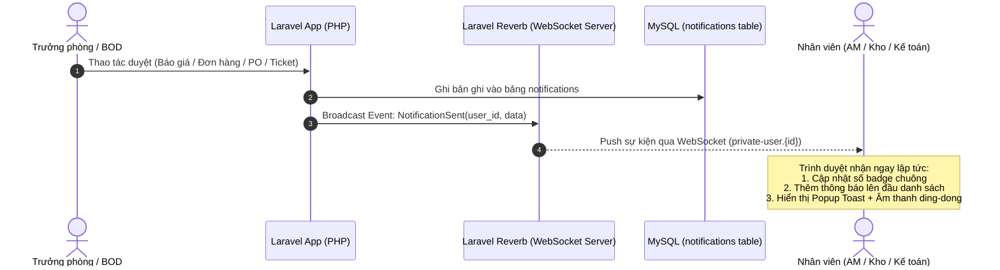

# Kế Hoạch Triển Khai Thông Báo Realtime (Laravel Reverb / WebSockets)

> **Mục tiêu:** Nâng cấp hệ thống thông báo từ cơ chế **Polling (30 giây/lần)** sang **Realtime Push tức thì (< 100ms)** bằng Laravel Reverb (chính thức của Laravel, mã nguồn mở, miễn phí 100%, tự host trên VPS nội bộ).

---

## 1. Kiến Trúc Hoạt Động (Architecture Flow)



---

## 2. Các Bước Kỹ Thuật Chi Tiết (Implementation Steps)

### Bước 1: Cài đặt Laravel Reverb & Broadcasting Backend

```bash
# 1. Cài đặt package Reverb
composer require laravel/reverb

# 2. Chạy lệnh publish cấu hình Reverb
php artisan reverb:install
```

File `.env` trên Server Production:
```env
BROADCAST_CONNECTION=reverb

REVERB_APP_ID=erp_crm_reverb_id
REVERB_APP_KEY=erp_crm_reverb_key
REVERB_APP_SECRET=erp_crm_reverb_secret
REVERB_HOST="crm.ringnet.vn"
REVERB_PORT=443
REVERB_SCHEME=https

VITE_REVERB_APP_KEY="${REVERB_APP_KEY}"
VITE_REVERB_HOST="${REVERB_HOST}"
VITE_REVERB_PORT="${REVERB_PORT}"
VITE_REVERB_SCHEME="${REVERB_SCHEME}"
```

---

### Bước 2: Tạo Broadcast Event trong Laravel

Tạo file Event `app/Events/NotificationSent.php`:

```php
<?php

namespace App\Events;

use App\Models\Notification;
use Illuminate\Broadcasting\Channel;
use Illuminate\Broadcasting\InteractsWithSockets;
use Illuminate\Broadcasting\PrivateChannel;
use Illuminate\Contracts\Broadcasting\ShouldBroadcastNow;
use Illuminate\Foundation\Events\Dispatchable;
use Illuminate\Queue\SerializesModels;

class NotificationSent implements ShouldBroadcastNow
{
    use Dispatchable, InteractsWithSockets, SerializesModels;

    public $notification;

    public function __construct(Notification $notification)
    {
        $this->notification = [
            'id' => $notification->id,
            'title' => $notification->title,
            'message' => $notification->message,
            'type' => $notification->type,
            'icon' => $notification->icon ?? 'bell',
            'link' => $notification->link,
            'created_at' => $notification->created_at->toISOString(),
            'is_read' => false,
        ];
    }

    public function broadcastOn(): array
    {
        // Gửi tới kênh riêng của người nhận thông báo
        return [
            new PrivateChannel('user.' . $this->notification['user_id'] ?? $this->notification->user_id),
        ];
    }

    public function broadcastAs(): string
    {
        return 'notification.created';
    }
}
```

Trong `routes/channels.php` (Ủy quyền bảo mật kênh người dùng):
```php
Broadcast::channel('user.{id}', function ($user, $id) {
    return (int) $user->id === (int) $id;
});
```

Tự động kích hoạt khi có thông báo (trong `app/Models/Notification.php` hoặc Observer):
```php
protected static function booted()
{
    static::created(function ($notification) {
        broadcast(new \App\Events\NotificationSent($notification));
    });
}
```

---

### Bước 3: Cấu hình Frontend (Laravel Echo + Pusher-js)

Cài đặt package frontend:
```bash
npm install --save-dev laravel-echo pusher-js
```

Cập nhật `resources/js/bootstrap.js` hoặc tích hợp vào `public/js/notification-bell.js`:
```javascript
import Echo from 'laravel-echo';
import Pusher from 'pusher-js';

window.Pusher = Pusher;

window.Echo = new Echo({
    broadcaster: 'reverb',
    key: import.meta.env.VITE_REVERB_APP_KEY,
    wsHost: import.meta.env.VITE_REVERB_HOST,
    wsPort: import.meta.env.VITE_REVERB_PORT ?? 80,
    wssPort: import.meta.env.VITE_REVERB_PORT ?? 443,
    forceTLS: (import.meta.env.VITE_REVERB_SCHEME ?? 'https') === 'https',
    enabledTransports: ['ws', 'wss'],
});

// Lắng nghe kênh riêng của người dùng hiện tại
const currentUserId = document.querySelector('meta[name="user-id"]')?.content;

if (currentUserId) {
    window.Echo.private(`user.${currentUserId}`)
        .listen('.notification.created', (e) => {
            // 1. Tăng số lượng thông báo chưa đọc
            if (window.notificationBellInstance) {
                window.notificationBellInstance.unreadCount++;
                window.notificationBellInstance.notifications.unshift(e.notification);
            }

            // 2. Phát âm thanh chuông báo (ding-dong)
            const audio = new Audio('/sounds/notification.mp3');
            audio.play().catch(() => {});

            // 3. Hiển thị Toast thông báo góc phải màn hình
            if (window.Toast) {
                window.Toast.fire({
                    icon: 'info',
                    title: e.notification.title,
                    text: e.notification.message,
                });
            }
        });
}
```

---

### Bước 4: Cấu hình Nginx & Supervisor trên Production (VPS Ubuntu/Linux)

#### 1. Cấu hình Supervisor để Reverb luôn chạy nền:
File `/etc/supervisor/conf.d/reverb.conf`:
```ini
[program:reverb]
process_name=%(program_name)s_%(process_num)02d
command=php /var/www/erp-crm/artisan reverb:start --host=0.0.0.0 --port=8080
autostart=true
autorestart=true
user=www-data
redirect_stderr=true
stdout_logfile=/var/www/erp-crm/storage/logs/reverb.log
stopwaitsecs=3600
```

#### 2. Cấu hình Nginx Proxy WebSocket qua SSL (HTTPS / WSS):
Trong file cấu hình Nginx site `/etc/nginx/sites-available/crm`:
```nginx
location /reverb {
    proxy_pass http://127.0.0.1:8080;
    proxy_http_version 1.1;
    proxy_set_header Upgrade $http_upgrade;
    proxy_set_header Connection "Upgrade";
    proxy_set_header Host $host;
    proxy_set_header X-Real-IP $remote_addr;
    proxy_set_header X-Forwarded-For $proxy_add_x_forwarded_for;
    proxy_set_header X-Forwarded-Proto $scheme;
}
```

---

## 3. Lợi Ích Sau Khi Triển Khai
1. **Tức thời (Realtime):** Nhận thông báo duyệt đơn, ký hợp đồng, cấp phát vật phẩm ngay khi đồng nghiệp bấm nút.
2. **Tiết kiệm tài nguyên máy chủ:** Giảm hàng trăm ngàn lượt request Ajax định kỳ 30s của hàng chục user hàng ngày.
3. **Trải nghiệm chuyên nghiệp:** Giao diện tự động nhảy số chuông đỏ + âm thanh thông báo + toast popup hiện đại.
